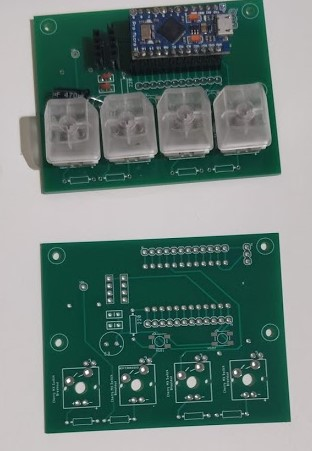
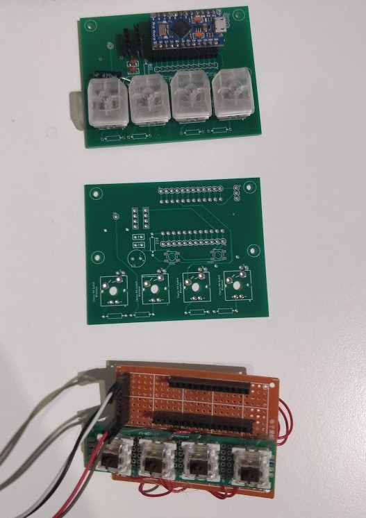

# Arduino_MediaKeys
This project is to make custom key for windows, as of now it is used for media keys (prev,next,play/pause) and to use F19 and F20 to keybinds for discord or what key is defined

the future for project, is to add a display that can pull information from spotify and display the song and more info as a start. 

# Dependencies:
  HID-Project by NicoHood Version 2.5.0 or above
  - can be found in Arduino Lirary Manager
  - or: https://github.com/NicoHood/HID

# Reference:
  The Reference links below is where the info to getting the project to work comes from
  - https://uboopenfactory.univ-brest.fr/Les-Labs/MusicLab/Projets/Arduino-Media-Keys
   ## Most code inspiration comes from here:
  - https://github.com/NicoHood/HID/wiki
  - https://www.arduino.cc/reference/en/language/functions/usb/keyboard/
  - https://www.stefanjones.ca/blog/arduino-leonardo-remote-multimedia-keys/
  - https://arduino.stackexchange.com/questions/8934/send-keyboard-media-keys-with-keyboard-library
  - http://www.freebsddiary.org/APC/usb_hid_usages.php
  - list of hid codes for further use or differt use case
  https://www.instructables.com/id/USB-Volume-Control-and-Caps-Lock-LED-Simple-Cheap-/

# PCB 
```the pcb was design in eagle```  

### With old prototype board

